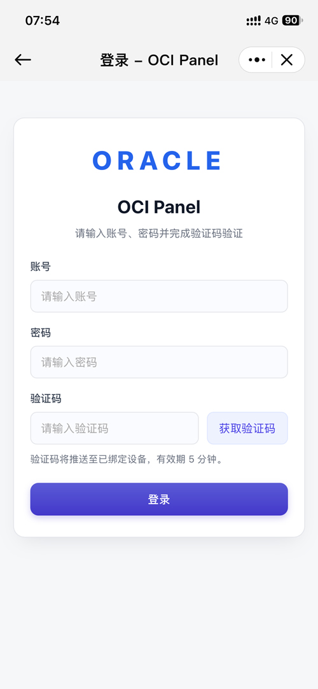
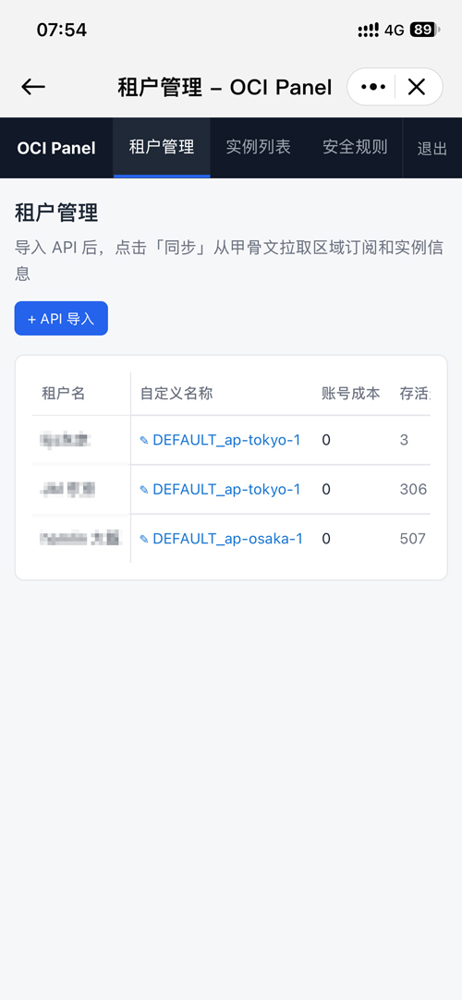
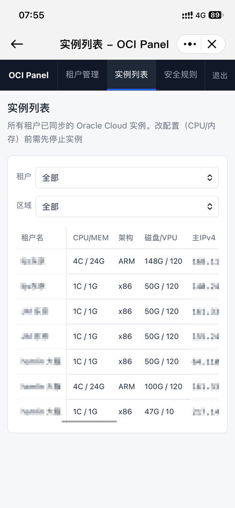
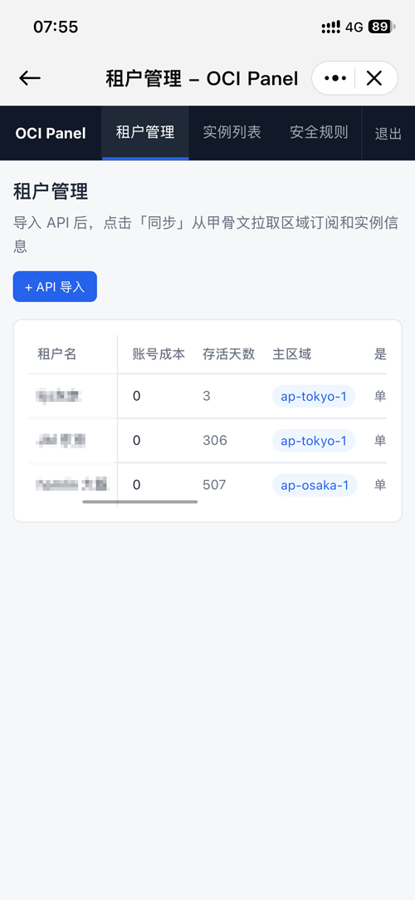
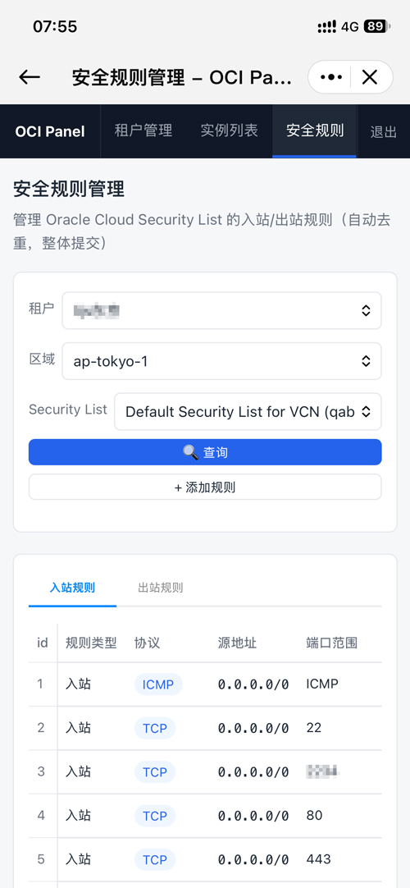
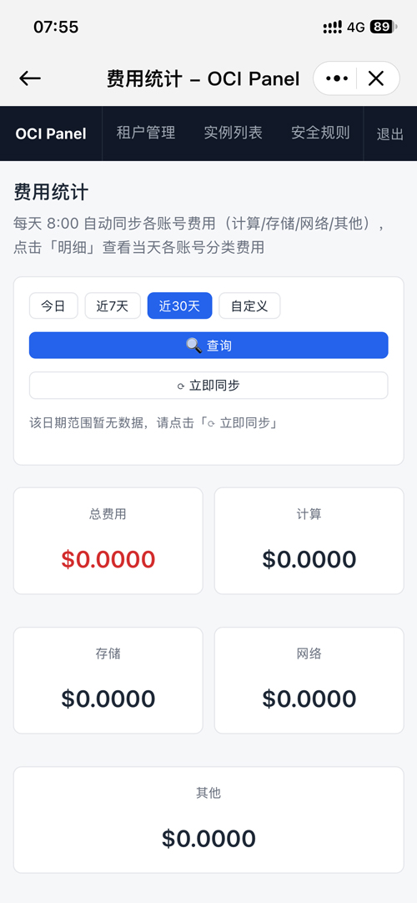
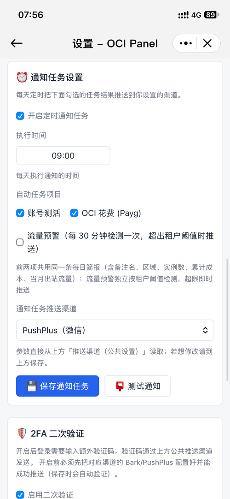
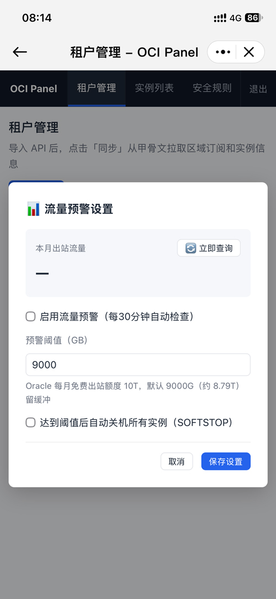
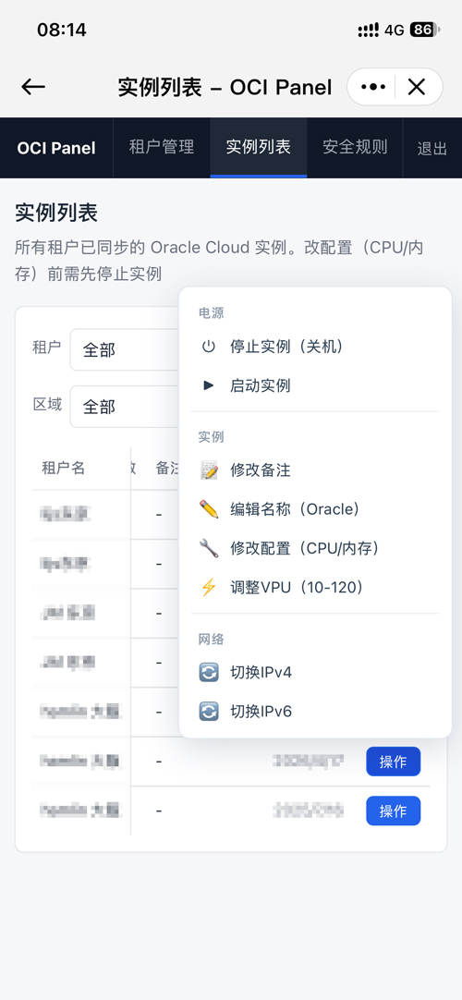
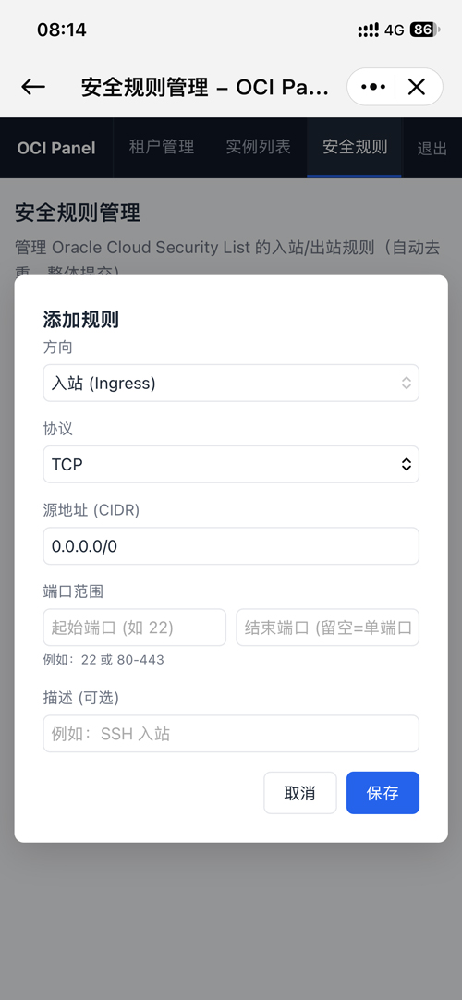

# OCI Panel

Oracle Cloud（OCI）多租户管理面板。单二进制部署，内存与镜像体积小，功能完整。

## 功能

### 租户管理
- 导入 OCI API 凭据（Tenancy / User OCID + 私钥，AES-256-GCM 加密存储）
- 一键测试连接、同步实例数据
- 展示账号类型、主区域、多区域、实例数、账号状态等

### 实例管理
- 启动 / 停止实例
- 重命名、添加备注
- 在线调整 CPU / 内存（Flex 形状）
- 调整引导卷 VPU 性能档位（10–120）
- 一键切换公网 IPv4
- 启用 / 切换 IPv6（自动准备 VCN、子网 CIDR、网关、路由）

### 安全规则
- 可视化查看 / 增 / 删 / 改安全规则（Ingress / Egress）
- 支持 TCP / UDP / ICMP 协议与端口范围
- 按租户区域切换

### 费用统计
- 按日 / 按类目聚合费用
- 每日 8:00 自动同步，支持手动同步
- 按 SKU / 资源查询明细

### 流量监控
- 基于 VNIC 监控指标统计月度进出站流量
- 阈值预警推送，可配置超额自动关机（SOFTSTOP）
- 每 30 分钟自动检查

### 通知与安全
- Bark / PushPlus 推送渠道
- 登录二次验证（2FA 验证码推送，5 分钟有效）
- 每日定点简报：累计花费、账号健康、实例明细
- 设置导出 / 导入，密码修改

## 界面演示

| | |
|---|---|
|  |  |
|  |  |
|  |  |
|  |  |
|  |  |

## 部署

### Docker（推荐）

```bash
docker run -d \
  --name oci-panel \
  -p 8800:8800 \
  -v oci-panel-data:/app/data \
  -e ADMIN_PASSWORD=你的管理员密码 \
  oci-panel
```

或使用 `docker-compose.yml`：

```yaml
services:
  oci-panel:
    build: .
    ports:
      - "8800:8800"
    volumes:
      - ./data:/app/data
    environment:
      - ADMIN_PASSWORD=你的管理员密码
    restart: unless-stopped
```

```bash
docker compose up -d
```

访问 `http://服务器IP:8800`，首次访问会进入初始化页面创建管理员账号（或通过 `ADMIN_PASSWORD` 环境变量直接创建 `admin`）。

### 环境变量

| 变量 | 默认值 | 说明 |
|---|---|---|
| `PORT` | `8800` | 监听端口 |
| `DATA_DIR` | `/app/data` | 数据目录（store.json、密钥） |
| `ADMIN_PASSWORD` | 无 | 首次启动自动创建 admin 账号 |
| `SESSION_SECRET` | 自动生成并持久化 | Session 签名密钥 |

### 源码编译

```bash
go build -trimpath -ldflags="-s -w" -o oci-panel .
PORT=8800 DATA_DIR=./data ./oci-panel
```

## 数据与迁移

所有数据存储在 `DATA_DIR` 下的 `store.json`，字段格式与 Node.js 版互通，可直接将原版数据目录拷贝过来使用。

> 注意：`data/` 目录包含私钥加密密钥与 session 密钥，请妥善备份，切勿泄露。

## 技术栈

- Go 1.26 + OCI Go SDK v65
- 标准库 `net/http` + `html/template`
- `robfig/cron/v3` 定时任务、`scrypt` 密码哈希、AES-256-GCM 私钥加密、HMAC-SHA256 签名 Cookie
